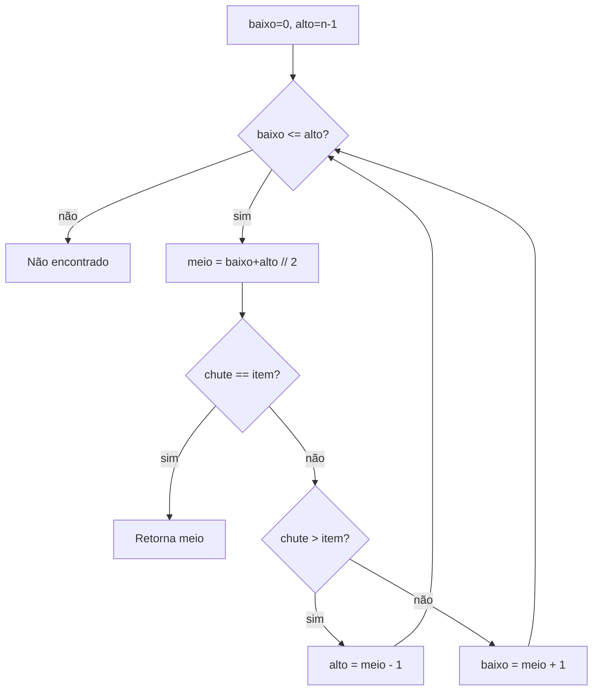

# Capítulo 1 — Introdução e busca binária 🔍

## Ideia central

Este capítulo apresenta o que é um **algoritmo** e como medir sua **velocidade**
com a notação **Big-O**. O exemplo estrela é a **busca binária**: para encontrar
um item numa lista **ordenada**, você corta a lista pela metade a cada passo, em
vez de olhar item por item.

## Analogia

:::note[Analogia: a lista telefônica]
Procurar "Silva" numa lista telefônica. A busca **linear** começa na primeira
página e vai virando uma a uma. A busca **binária** abre no meio: "Silva vem
antes ou depois daqui?" e descarta metade da lista de uma vez. Com 1 milhão de
nomes, a linear pode levar 1 milhão de passos; a binária leva ~20.
:::

## Como funciona

A busca binária trabalha com `baixo` e `alto` (os limites da parte ainda não
descartada) e olha o elemento do `meio`:

1. Calcule o `meio` entre `baixo` e `alto`.
2. Se o chute do meio **é** o item → achou.
3. Se o chute é **maior** que o item → o item está à esquerda (`alto = meio - 1`).
4. Se o chute é **menor** → o item está à direita (`baixo = meio + 1`).
5. Repita até `baixo > alto` (não achou).



## Implementação em Python

> Código em `chapter01/binarySearch.py`.

```python title="chapter01/binarySearch.py"
def pesquisaBinaria(lista, item):
    baixo = 0
    alto = len(lista) - 1

    while baixo <= alto:
        meio = (baixo + alto) // 2   # índice do meio (divisão inteira)
        chute = lista[meio]
        if chute == item:
            return meio              # achou: retorna a posição
        if chute > item:
            alto = meio - 1          # item está na metade de baixo
        else:
            baixo = meio + 1         # item está na metade de cima
    return None                      # item não está na lista

minhaLista = [1, 3, 5, 7, 9]
print(pesquisaBinaria(minhaLista, 3))   # 1
print(pesquisaBinaria(minhaLista, -1))  # None
```

:::warning[A lista PRECISA estar ordenada]
A busca binária só funciona em listas **ordenadas**. Se a sua lista não está
ordenada, ou você ordena antes, ou usa busca linear.
:::

## Complexidade (Big-O)

:::info[Tempo e espaço]
- **Busca binária:** tempo **O(log n)**, espaço **O(1)**.
- **Busca linear:** tempo **O(n)**.

`log₂ n` é o número de vezes que dá para dividir `n` por 2 até chegar a 1.
Para 1.024 itens são ~10 passos; para 1 bilhão, ~30. Veja o
[cheatsheet de Big-O](../referencia/big-o-cheatsheet.md).
:::

## Dúvidas comuns

<details>
<summary>Por que `meio = (baixo + alto) // 2` usa `//`?</summary>

`//` é divisão **inteira** em Python: índice de lista precisa ser inteiro.
`7 // 2 == 3`. Com `/` viria `3.5`, que não serve como índice.

</details>

<details>
<summary>O que acontece se o item não estiver na lista?</summary>

Os limites `baixo` e `alto` se aproximam até `baixo > alto`. O `while` para e
a função retorna `None`.

</details>

<details>
<summary>Por que O(log n) é tão melhor que O(n)?</summary>

Porque dobrar a entrada adiciona apenas **um** passo na busca binária, mas
**dobra** o trabalho da busca linear. A diferença explode com `n` grande.

</details>

## Exercícios

<details>
<summary>1.1 — Lista de 128 nomes: quantos passos no máximo?</summary>

`log₂ 128 = 7`. No máximo **7 passos**.

</details>

<details>
<summary>1.2 — E se a lista dobrar para 256 nomes?</summary>

`log₂ 256 = 8`. Apenas **8 passos** — só +1 ao dobrar a lista.

</details>

<details>
<summary>1.3 — Big-O da busca linear no pior caso?</summary>

**O(n)** — pode ser preciso olhar todos os `n` elementos.

</details>

## Checklist de domínio

- [ ] Sei explicar a diferença entre busca linear e binária.
- [ ] Consigo implementar a busca binária de memória.
- [ ] Sei por que a lista precisa estar ordenada.
- [ ] Sei dizer e justificar o Big-O de ambas as buscas.
- [ ] Entendo a intuição de `O(log n)`.
