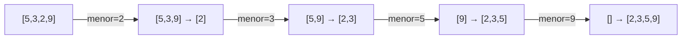

# Capítulo 2 — Selection sort 🗂️

## Ideia central

Antes de ordenar, o capítulo explica como a memória guarda dados em dois formatos:
**arrays** (arranjos) e **listas ligadas**. Depois aprespenta o **selection sort**
(ordenação por seleção): um algoritmo simples que ordena escolhendo
repetidamente o menor elemento restante.

## Analogia

!!! note "Analogia: a lista de músicas favoritas"
    Você quer ordenar suas músicas da mais tocada para a menos tocada. Percorre
    toda a lista, acha a mais tocada e a coloca numa nova lista. Repete com as
    restantes. Cada vez você varre a lista inteira de novo — por isso é "lento".

## Arrays vs. listas ligadas

| Operação | Array | Lista ligada |
|----------|-------|--------------|
| Leitura (acesso ao i-ésimo) | **O(1)** | O(n) |
| Inserção/remoção (no ponto) | O(n) | **O(1)** |
| Memória | posições contíguas | espalhada (com ponteiros) |

!!! tip "Quando usar cada um"
    Muitas **leituras aleatórias** → array. Muitas **inserções/remoções** →
    lista ligada. Veja a discussão no [FAQ](../faq-duvidas.md).

## Como funciona o selection sort

1. Percorra a lista e ache o **menor** elemento.
2. Remova-o e coloque-o no fim de uma nova lista.
3. Repita com o que sobrou, até esvaziar a lista original.



## Implementação em Python

> Código em `chapter02/selectionSort.py`.

```python title="chapter02/selectionSort.py"
def buscaMenor(arr):
    menor = arr[0]            # supõe que o primeiro é o menor
    menorIndice = 0
    for i in range(1, len(arr)):
        if arr[i] < menor:    # achou um menor ainda
            menor = arr[i]
            menorIndice = i
    return menorIndice        # retorna a POSIÇÃO do menor

def ordenacaoPorSelecao(arr):
    novoArr = []
    for i in range(len(arr)):
        menor = buscaMenor(arr)        # índice do menor restante
        novoArr.append(arr.pop(menor)) # remove da origem e anexa no destino
    return novoArr

print(ordenacaoPorSelecao([5, 3, 2, 9, 10, 2.5]))
# [2, 2.5, 3, 5, 9, 10]
```

!!! note "Detalhe: esta versão consome a lista original"
    Como usa `arr.pop(...)`, a lista de entrada fica **vazia** ao final. Se quiser
    preservar a original, passe uma cópia: `ordenacaoPorSelecao(minha[:])`.

## Complexidade (Big-O)

!!! info "Tempo e espaço"
    - **Tempo: O(n²)** — para cada um dos `n` elementos, você varre a lista
      inteira procurando o menor (`buscaMenor` é O(n)).
    - **Espaço: O(n)** — esta implementação cria uma nova lista `novoArr`.

## Dúvidas comuns

??? question "Por que é O(n²) e não O(n × n/2)?"
    A cada passo a lista diminui, então são n + (n-1) + ... + 1 operações, que dá
    ~n²/2. Em Big-O, **constantes são ignoradas**, então fica **O(n²)**.

??? question "`buscaMenor` retorna o valor ou a posição?"
    A **posição** (índice). Isso é necessário porque `arr.pop(indice)` remove pelo
    índice.

??? question "Selection sort é usado na prática?"
    Raramente — é didático. Na vida real, use o `sorted()`/`.sort()` do Python
    (que usa Timsort, O(n log n)). Você verá um algoritmo rápido no
    [cap. 4 (quicksort)](04-quicksort.md).

## Exercícios

??? success "2.1 — Você precisa de muitas leituras aleatórias. Array ou lista ligada?"
    **Array** — leitura por índice é O(1).

??? success "2.2 — Inserções frequentes no meio. Qual estrutura?"
    **Lista ligada** — inserção/remoção é O(1) (uma vez no ponto certo).

??? success "2.3 — Big-O do selection sort?"
    **O(n²)** no tempo, em qualquer caso.

## Checklist de domínio

- [ ] Sei diferenciar array de lista ligada e seus Big-O.
- [ ] Consigo implementar `buscaMenor` e o selection sort.
- [ ] Sei explicar por que o selection sort é O(n²).
- [ ] Entendo que esta versão esvazia a lista de entrada.
