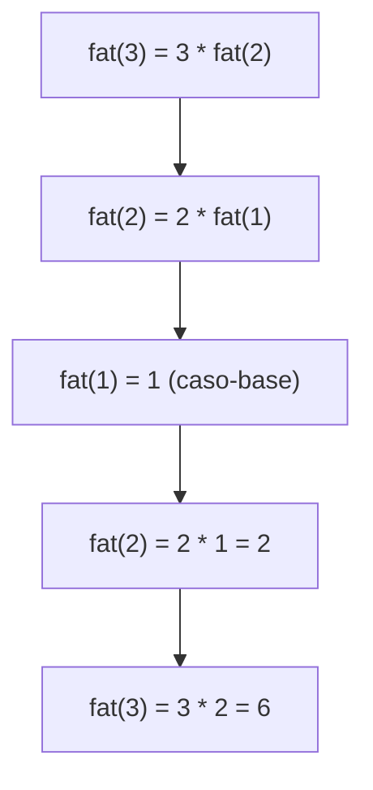

# Capítulo 3 — Recursão 🔁

## Ideia central

**Recursão** é quando uma função chama a si mesma. Toda função recursiva precisa
de duas partes: o **caso-base** (quando parar) e o **caso-recursivo** (quando
chamar a si mesma de novo). O capítulo também mostra a **pilha de chamadas**
(call stack), que é como o computador guarda as chamadas em andamento.

## Analogia

!!! note "Analogia: a caixa com a chave"
    Você procura uma chave numa caixa que contém outras caixas, que contêm outras
    caixas... A versão **iterativa** usa uma pilha de caixas a abrir. A versão
    **recursiva** diz: "para cada item da caixa: se for uma caixa, procure dentro
    dela (recursão!); se for a chave, achei". Mais limpa de ler.

## Caso-base e caso-recursivo

Sem caso-base, a recursão **nunca para** (e estoura a pilha):

```python title="chapter03/casoBaseVsCasoRecursivo/regressiva.py — SEM caso-base (erro!)"
def regressiva(i):
    print(i)
    regressiva(i - 1)   # nunca para → RecursionError
```

Com caso-base, ela termina:

```python title="chapter03/casoBaseVsCasoRecursivo/regressivaComCB.py"
def regressiva(i):
    print(i)
    if i <= 1:          # CASO-BASE: condição de parada
        return
    else:
        regressiva(i - 1)  # CASO-RECURSIVO

i = int(input('i= '))
regressiva(i)
```

## A pilha de chamadas (call stack)

Quando uma função chama outra, a primeira fica "pausada" no topo da pilha,
esperando a segunda terminar:

```python title="chapter03/callStack/sauda.py"
def sauda(nome):
    print(f'Ola, {nome}!')
    sauda2(nome)
    print('Preparando para dizer tchau...')
    tchau()

def sauda2(nome):
    print(f'Tudo bem {nome}')

def tchau():
    print('Tchau!')
```

Na recursão, **cada chamada empilha um novo quadro**. O fatorial deixa isso claro:

```python title="chapter03/recursiveCallStack/fatorial.py"
def fat(x):
    if x == 1:          # caso-base
        return 1
    else:
        return x * fat(x - 1)   # caso-recursivo

print(fat(3))   # 6
```



!!! warning "A pilha tem limite"
    Cada chamada recursiva consome memória na pilha. Recursão muito profunda gera
    `RecursionError` (estouro de pilha). Para esses casos, prefira um loop.

## A caixa com a chave (iterativo × recursivo)

```python title="chapter03/recursaoCaixa/algoritmo2.py — versão recursiva"
def procurePelaChave(caixa):
    for item in caixa:
        if item.ehUmaCaixa():
            procurePelaChave(item)   # Recursão!
        elif item.ehUmaChave():
            print('chave encontrada!')
```

## Complexidade (Big-O)

!!! info "Recursão e custo"
    Recursão não é, por si, mais rápida ou mais lenta que um loop. O Big-O depende
    de **quantas chamadas** acontecem × **o trabalho por chamada**. A recursão
    usa **espaço O(profundidade)** na pilha de chamadas.

## Dúvidas comuns

??? question "Recursão é mais rápida que loop?"
    Não necessariamente. Costuma ser mais **legível**, mas usa memória na pilha.
    Para problemas "auto-similares" (caixas, árvores, dividir-para-conquistar) ela
    brilha. Veja o [FAQ](../faq-duvidas.md).

??? question "O que é `RecursionError`?"
    É o erro que o Python lança quando a recursão fica profunda demais (sem
    caso-base, ou com profundidade gigante) e a pilha de chamadas estoura.

??? question "Toda recursão tem solução iterativa?"
    Sim. Recursão e iteração têm o mesmo poder. A escolha é de clareza e de uso de
    memória.

## Exercícios

??? success "3.1 — O que falta na função `regressiva` infinita?"
    Um **caso-base**: `if i <= 1: return`.

??? success "3.2 — Escreva `soma(lista)` recursiva."
    ```python
    def soma(lista):
        if not lista:          # caso-base: lista vazia
            return 0
        return lista[0] + soma(lista[1:])
    ```
    (Você verá exatamente isso no [cap. 4](04-quicksort.md).)

??? success "3.3 — Quantos quadros na pilha em `fat(5)` no ponto mais fundo?"
    5: `fat(5)`, `fat(4)`, `fat(3)`, `fat(2)`, `fat(1)`.

## Checklist de domínio

- [ ] Sei identificar o caso-base e o caso-recursivo de uma função.
- [ ] Consigo desenhar a pilha de chamadas de uma recursão.
- [ ] Sei por que falta de caso-base causa `RecursionError`.
- [ ] Consigo reescrever um loop simples como recursão (e vice-versa).
