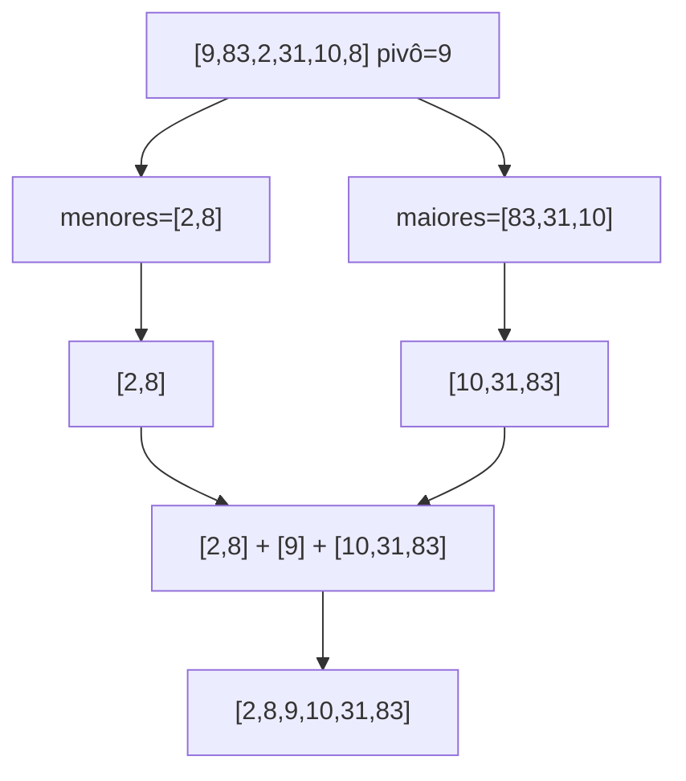

# Capítulo 4 — Quicksort ⚡

## Ideia central

Este capítulo apresenta a técnica **dividir para conquistar** (D&C): quebrar um
problema em subproblemas menores **do mesmo tipo**, até chegar a um caso simples
(caso-base). O algoritmo estrela é o **quicksort**, uma ordenação elegante e
rápida construída sobre D&C e recursão.

## Analogia

!!! note "Analogia: dividir o terreno em quadrados"
    Para dividir um terreno retangular nos maiores quadrados iguais possíveis, você
    acha o maior quadrado que cabe, e repete o D&C no pedaço que sobra. Sempre o
    **mesmo problema, menor**, até acabar.

## Dividir para conquistar (D&C)

A receita do D&C tem dois passos:

1. Descubra o **caso-base** (o menor caso possível, fácil de resolver).
2. **Reduza** o problema até cair no caso-base.

Exemplos do capítulo (versões corrigidas, com caso-base de **lista vazia**):

```python title="chapter04/divideAndConquer/divideAndConquer01.py — soma recursiva"
def soma(lista):
    if not lista:                 # caso-base: lista vazia → 0
        return 0
    return lista[0] + soma(lista[1:])
```

```python title="chapter04/divideAndConquer/divideAndConquer02.py — contar elementos"
def conta(lista):
    if not lista:
        return 0
    return 1 + conta(lista[1:])
```

```python title="chapter04/divideAndConquer/divideAndConquer03.py — máximo da lista"
def maximo(lista):
    if len(lista) == 2:
        return lista[0] if lista[0] > lista[1] else lista[1]
    subMax = maximo(lista[1:])
    return lista[0] if lista[0] > subMax else subMax
```

!!! warning "Cuidado com o caso-base"
    Uma armadilha comum é escrever `if lista == 0` em vez de `if not lista`
    (lista vazia). `lista == 0` nunca é verdade para uma lista, então a recursão
    não para. Sempre teste o caso-base com **lista vazia** e **um elemento**.

## Como funciona o quicksort

1. **Caso-base:** listas com 0 ou 1 elemento já estão ordenadas.
2. Escolha um **pivô** (aqui, o primeiro elemento).
3. **Particione**: separe os **menores** e os **maiores** que o pivô.
4. Resultado = `quicksort(menores)` + `[pivô]` + `quicksort(maiores)`.



## Implementação em Python

> Código em `chapter04/quicksort/quicksort.py`.

```python title="chapter04/quicksort/quicksort.py"
def quicksort(array):
    if len(array) < 2:
        return array                 # caso-base: 0 ou 1 elemento
    else:
        pivo = array[0]              # pivô = primeiro elemento
        menores = [i for i in array[1:] if i < pivo]   # < pivô
        maiores = [i for i in array[1:] if i > pivo]   # > pivô
        return quicksort(menores) + [pivo] + quicksort(maiores)

print(quicksort([9, 83, 2, 31, 10, 8]))
# [2, 8, 9, 10, 31, 83]
```

!!! note "E os elementos iguais ao pivô?"
    Esta versão usa `<` e `>`, então valores **iguais** ao pivô (exceto o próprio)
    seriam descartados. Para listas com repetidos, use `<=`/`>=` em um dos lados,
    ou separe em três grupos (`menores`, `iguais`, `maiores`).

## Complexidade (Big-O)

!!! info "Depende do pivô"
    - **Caso médio: O(n log n)** — pivô divide a lista em metades equilibradas.
    - **Pior caso: O(n²)** — pivô sempre o menor/maior (ex.: lista já ordenada com
      pivô na ponta). Partições ficam totalmente desbalanceadas.
    - **Espaço: O(log n)** (pilha de recursão, no caso médio).

    Dica prática: escolher um **pivô aleatório** torna o pior caso muito
    improvável. Veja o [cheatsheet](../referencia/big-o-cheatsheet.md).

## Dúvidas comuns

??? question "Por que o caso médio é O(n log n)?"
    Cada nível de recursão processa todos os `n` elementos (particionar é O(n)), e
    há ~`log n` níveis quando as partições são equilibradas. n × log n = O(n log n).

??? question "Quando o quicksort vira O(n²)?"
    Quando o pivô é sempre o menor (ou maior) elemento — aí uma partição fica vazia
    e a outra com quase tudo, gerando `n` níveis em vez de `log n`.

??? question "Quicksort × selection sort: qual a diferença prática?"
    Selection sort é sempre O(n²); quicksort é O(n log n) no caso médio. Para
    `n = 1000`, ~1 milhão vs. ~10 mil operações.

??? question "Por que `len(array) < 2` é o caso-base?"
    Listas com 0 ou 1 elemento já estão ordenadas — não há o que fazer. É a
    condição que para a recursão.

## Exercícios

??? success "4.1 — Big-O para imprimir cada elemento de uma lista?"
    **O(n)** — um por um.

??? success "4.2 — Big-O do quicksort no melhor/caso médio e no pior?"
    Médio: **O(n log n)**. Pior: **O(n²)**.

??? success "4.3 — Reescreva `maximo` com caso-base de lista vazia/1 elemento."
    ```python
    def maximo(lista):
        if not lista:
            return None
        if len(lista) == 1:
            return lista[0]
        subMax = maximo(lista[1:])
        return lista[0] if lista[0] > subMax else subMax
    ```

## Checklist de domínio

- [ ] Sei explicar a receita do "dividir para conquistar".
- [ ] Consigo implementar o quicksort de memória.
- [ ] Sei o papel do pivô e como ele afeta o Big-O.
- [ ] Sei por que o pior caso é O(n²) e como evitá-lo.
- [ ] Identifico armadilhas de caso-base (lista vazia, repetidos).
