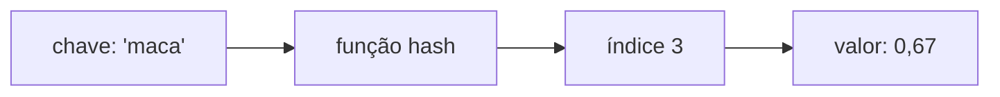

# Capítulo 5 — Tabelas hash 🗃️

## Ideia central

Uma **tabela hash** mapeia **chaves** a **valores** e permite buscar, inserir e
remover em tempo **O(1) médio**. Por trás, uma **função hash** transforma a chave
num índice de um array. Em Python, a tabela hash é o tipo `dict`.

## Analogia

:::note[Analogia: a atendente que sabe tudo de cor]
Numa lanchonete, em vez de procurar o preço numa lista, você pergunta à
atendente e ela responde na hora. A função hash é a "memória" dela: dada a
chave (nome do item), ela vai direto ao valor (preço), sem procurar.
:::

## Como funciona

1. A **função hash** recebe a chave e devolve um índice do array.
2. O valor é guardado nesse índice.
3. Para buscar, aplica-se a mesma função hash à chave → vai direto ao valor.



### Colisões

Duas chaves podem cair no mesmo índice (**colisão**). A solução clássica é
guardar uma **lista ligada** em cada slot. Se uma lista crescer muito, a busca
piora para O(n) — por isso uma boa função hash e um **fator de carga** baixo
importam.

:::tip[Fator de carga]
`fator de carga = itens / slots`. Acima de ~0,7, é hora de **redimensionar**
(criar um array maior e reinserir). Isso mantém as buscas em O(1) médio.
:::

## Implementação em Python

Na prática você usa o `dict` nativo (que já é uma tabela hash):

```python title="Uso do dict (tabela hash nativa do Python)"
# Livro de preços
precos = {}
precos["maca"] = 0.67
precos["leite"] = 1.49
precos["abacate"] = 1.49

print(precos["abacate"])      # 1.49  -> busca O(1) média
print("leite" in precos)      # True
precos.pop("maca")            # remoção O(1) média

# Caso de uso clássico: evitar duplicatas / cache
votaram = {}
def checar_eleitor(nome):
    if votaram.get(nome):
        print("manda embora!")
    else:
        votaram[nome] = True
        print("deixa votar!")
```

<details>
<summary>Versão didática: tabela hash 'na mão' (para entender o interior)</summary>

```python
class TabelaHash:
    def __init__(self, tamanho=8):
        self.slots = [[] for _ in range(tamanho)]  # encadeamento

    def _indice(self, chave):
        return hash(chave) % len(self.slots)

    def inserir(self, chave, valor):
        slot = self.slots[self._indice(chave)]
        for par in slot:
            if par[0] == chave:        # atualiza se já existe
                par[1] = valor
                return
        slot.append([chave, valor])    # senão, adiciona

    def buscar(self, chave):
        slot = self.slots[self._indice(chave)]
        for c, v in slot:
            if c == chave:
                return v
        return None
```

</details>

## Complexidade (Big-O)

:::info[Tempo]
| Operação | Caso médio | Pior caso |
|----------|-----------|-----------|
| Busca | **O(1)** | O(n) |
| Inserção | **O(1)** | O(n) |
| Remoção | **O(1)** | O(n) |

O pior caso (O(n)) acontece com muitas colisões. Com boa função hash e fator
de carga baixo, fica O(1) na prática.
:::

## Dúvidas comuns

<details>
<summary>Quando usar tabela hash em vez de lista?</summary>

Quando você faz muitas **buscas por chave** (não por posição): índices,
contagens, caches, evitar duplicatas. É O(1) vs. O(n) da busca em lista.

</details>

<details>
<summary>O que é uma colisão e por que ela importa?</summary>

É quando duas chaves recebem o mesmo índice. Muitas colisões transformam a
busca em O(n). Por isso a função hash deve distribuir bem as chaves.

</details>

<details>
<summary>Por que dicionários em Python são tão rápidos?</summary>

Porque `dict` é uma tabela hash bem otimizada: a maioria das operações é O(1).

</details>

## Exercícios

<details>
<summary>5.1 — Cite 3 bons usos de tabela hash.</summary>

Cache (memorizar respostas), evitar duplicatas (lista de quem já votou),
índice/lookup rápido (preços por produto).

</details>

<details>
<summary>5.2 — O que mantém as operações em O(1)?</summary>

Uma boa função hash (poucas colisões) e fator de carga baixo (redimensionar
quando necessário).

</details>

<details>
<summary>5.3 — Big-O de busca numa tabela hash no pior caso?</summary>

**O(n)** — quando tudo colide no mesmo slot.

</details>

## Checklist de domínio

- [ ] Sei o que faz uma função hash.
- [ ] Sei explicar colisões e como tratá-las.
- [ ] Entendo fator de carga e redimensionamento.
- [ ] Reconheço quando usar `dict` em vez de lista.
- [ ] Sei o Big-O das operações (médio e pior caso).
