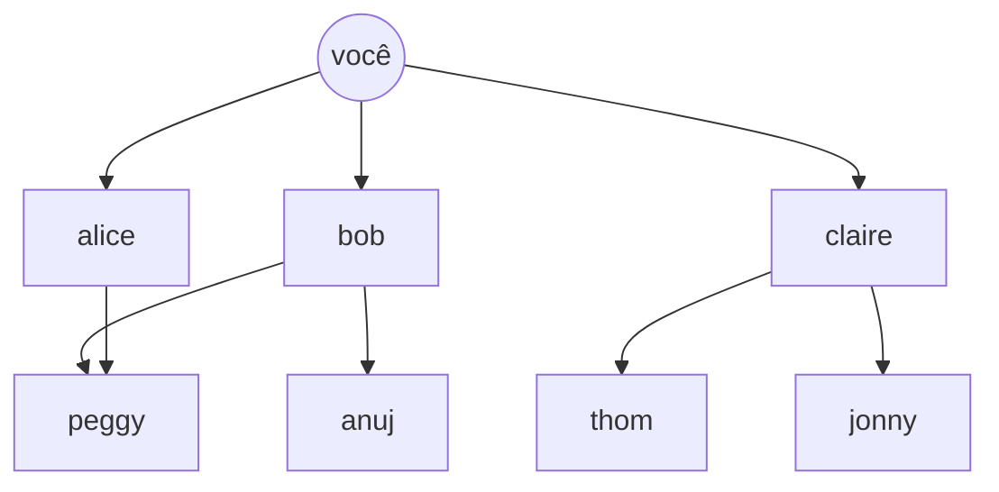

# Capítulo 6 — Busca em largura (BFS) 🌐

## Ideia central

Um **grafo** modela conexões (pessoas, cidades, páginas). A **busca em largura**
(breadth-first search, BFS) responde a duas perguntas: "existe um caminho de A até
B?" e "qual é o caminho **mais curto** (menos arestas) de A até B?". Ela explora o
grafo por **camadas**, usando uma **fila**.

## Analogia

:::note[Analogia: procurar um vendedor de mangas na sua rede]
Você quer achar um vendedor de mangas entre seus conhecidos. Primeiro pergunta
aos **amigos diretos** (1º grau). Se ninguém for, pergunta aos **amigos dos
amigos** (2º grau), e assim por diante. Você sempre checa os mais próximos
primeiro — por isso encontra o caminho **mais curto**.
:::

## Como funciona

1. Modele o grafo como um `dict`: cada nó → lista de vizinhos.
2. Coloque os vizinhos do nó inicial numa **fila** (`deque`).
3. Retire o primeiro da fila; se for o alvo, achou.
4. Senão, **adicione os vizinhos dele** ao **fim** da fila.
5. Marque quem já foi checado (para não entrar em loop).



:::warning[Use FILA, não pilha]
A BFS precisa de uma **fila** (FIFO): checar primeiro quem entrou primeiro
garante explorar por camadas e achar o caminho mais curto. Uma pilha (LIFO)
daria uma busca em profundidade (DFS), que **não** garante o caminho mais curto.
:::

## Implementação em Python

```python title="BFS: existe um vendedor de mangas?"
from collections import deque

# Grafo como dicionário (lista de adjacência)
grafo = {
    "voce":   ["alice", "bob", "claire"],
    "bob":    ["anuj", "peggy"],
    "alice":  ["peggy"],
    "claire": ["thom", "jonny"],
    "anuj":   [],
    "peggy":  [],
    "thom":   [],
    "jonny":  [],
}

def eh_vendedor(nome):
    return nome[-1] == "m"     # critério de exemplo: nome termina em "m"

def busca(inicio):
    fila = deque()
    fila += grafo[inicio]      # enfileira os vizinhos diretos
    checados = set()           # evita reprocessar (e loops)
    while fila:
        pessoa = fila.popleft()        # FIFO: retira do início
        if pessoa in checados:
            continue
        if eh_vendedor(pessoa):
            print(pessoa + " é um vendedor de mangas!")
            return True
        fila += grafo[pessoa]          # adiciona os vizinhos ao fim
        checados.add(pessoa)
    return False

busca("voce")   # thom é um vendedor de mangas!
```

## Complexidade (Big-O)

:::info[Tempo e espaço]
- **Tempo: O(V + A)** — no pior caso você visita todos os vértices (`V`) e
  percorre todas as arestas (`A`).
- **Espaço: O(V)** — a fila e o conjunto de checados.
:::

## Dúvidas comuns

<details>
<summary>Por que marcar quem já foi checado?</summary>

Sem isso, você pode ficar em **loop infinito** (A é amigo de B, B é amigo de A)
e reprocessar pessoas, perdendo tempo.

</details>

<details>
<summary>BFS acha sempre o caminho mais curto?</summary>

Sim, em grafos **sem peso** (ou com pesos iguais). Para arestas com pesos
diferentes, use [Dijkstra (cap. 7)](07-dijkstra.md).

</details>

<details>
<summary>Por que `deque` e não `list` para a fila?</summary>

`deque.popleft()` é O(1); `list.pop(0)` é O(n) (precisa deslocar tudo). Para
uma fila, `deque` é o certo.

</details>

## Exercícios

<details>
<summary>6.1 — BFS ou DFS para achar o caminho mais curto (sem pesos)?</summary>

**BFS** — ela explora por camadas.

</details>

<details>
<summary>6.2 — Qual estrutura a BFS usa e por quê?</summary>

Uma **fila** (FIFO), para checar primeiro os nós mais próximos do início.

</details>

<details>
<summary>6.3 — Big-O da BFS?</summary>

**O(V + A)** — vértices mais arestas.

</details>

## Checklist de domínio

- [ ] Sei representar um grafo com um `dict` (lista de adjacência).
- [ ] Consigo implementar a BFS com `deque`.
- [ ] Sei por que usar fila (e não pilha) e marcar os checados.
- [ ] Sei quando a BFS garante o caminho mais curto.
- [ ] Sei o Big-O da BFS.
