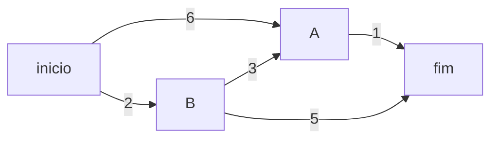

# Capítulo 7 — Algoritmo de Dijkstra 🛣️

## Ideia central

Enquanto a BFS acha o caminho com **menos arestas**, o **algoritmo de Dijkstra**
acha o caminho de **menor custo** num grafo **ponderado** (arestas com pesos).
É a base de GPS e roteamento de rotas.

## Analogia

:::note[Analogia: trocar caminhos por dinheiro/tempo]
Indo do ponto A ao B, cada trecho tem um custo (minutos, R$, km). O caminho com
**menos trechos** pode não ser o **mais barato**. Dijkstra soma os custos e
escolhe a rota de menor custo total.
:::

## Como funciona

Dijkstra usa três coisas: a tabela de **custos** (do início até cada nó), a tabela
de **pais** (para reconstruir o caminho) e um conjunto de nós já **processados**.

1. Pegue o nó **não processado de menor custo** conhecido.
2. Para cada vizinho dele, veja se chegar por ele é **mais barato** que o custo
   atual; se for, **atualize** o custo e o pai.
3. Marque o nó como processado.
4. Repita até processar todos.



> No grafo acima, o caminho mais curto em **arestas** seria início→B→fim (custo 7),
> mas o de **menor custo** é início→B→A→fim (2+3+1 = **6**).

## Implementação em Python

```python title="Dijkstra com tabelas de custos e pais"
# Grafo ponderado: nó -> {vizinho: peso}
grafo = {
    "inicio": {"a": 6, "b": 2},
    "a": {"fim": 1},
    "b": {"a": 3, "fim": 5},
    "fim": {},
}

infinito = float("inf")
custos = {"a": 6, "b": 2, "fim": infinito}
pais = {"a": "inicio", "b": "inicio", "fim": None}
processados = set()

def no_de_menor_custo(custos):
    menor_custo = infinito
    menor = None
    for no in custos:
        if custos[no] < menor_custo and no not in processados:
            menor_custo = custos[no]
            menor = no
    return menor

no = no_de_menor_custo(custos)
while no is not None:
    custo = custos[no]
    for vizinho, peso in grafo[no].items():
        novo_custo = custo + peso
        if novo_custo < custos.get(vizinho, infinito):  # achou rota mais barata
            custos[vizinho] = novo_custo
            pais[vizinho] = no
    processados.add(no)
    no = no_de_menor_custo(custos)

print(custos["fim"])   # 6
```

:::tip[Versão eficiente: use uma fila de prioridade]
`no_de_menor_custo` varre tudo (O(V) por passo). Com um **heap**
(`heapq`/fila de prioridade), Dijkstra fica **O(A log V)**.
:::

## Complexidade (Big-O)

:::info[Tempo]
- **Com fila de prioridade (heap): O(A log V)**.
- **Versão simples (varrendo custos): O(V²)**.
:::

## Dúvidas comuns

<details>
<summary>Dijkstra funciona com pesos negativos?</summary>

**Não.** Com arestas negativas, use **Bellman-Ford**. Dijkstra assume que
nenhum caminho fica mais barato ao adicionar arestas.

</details>

<details>
<summary>Qual a diferença entre BFS e Dijkstra?</summary>

BFS: menor **número de arestas** (grafo sem peso). Dijkstra: menor **custo
total** (grafo com peso). Se todos os pesos são iguais, BFS já resolve.

</details>

<details>
<summary>Para que serve a tabela de 'pais'?</summary>

Para **reconstruir o caminho**: começando do fim e seguindo os pais até o
início, você descobre a rota, não só o custo.

</details>

## Exercícios

<details>
<summary>7.1 — Dijkstra ou BFS para um mapa de estradas com distâncias?</summary>

**Dijkstra** — há pesos (distâncias).

</details>

<details>
<summary>7.2 — Por que Dijkstra falha com pesos negativos?</summary>

Porque ele "fecha" um nó assumindo que seu custo não vai mais diminuir — o que
deixa de valer com arestas negativas.

</details>

<details>
<summary>7.3 — Como recuperar o caminho, não só o custo?</summary>

Seguindo a tabela de **pais** do fim ao início e invertendo a sequência.

</details>

## Checklist de domínio

- [ ] Sei a diferença entre menor caminho (arestas) e menor custo.
- [ ] Entendo as tabelas de custos, pais e processados.
- [ ] Consigo executar Dijkstra à mão num grafo pequeno.
- [ ] Sei por que pesos negativos quebram o Dijkstra.
- [ ] Sei o Big-O (simples × com heap).
